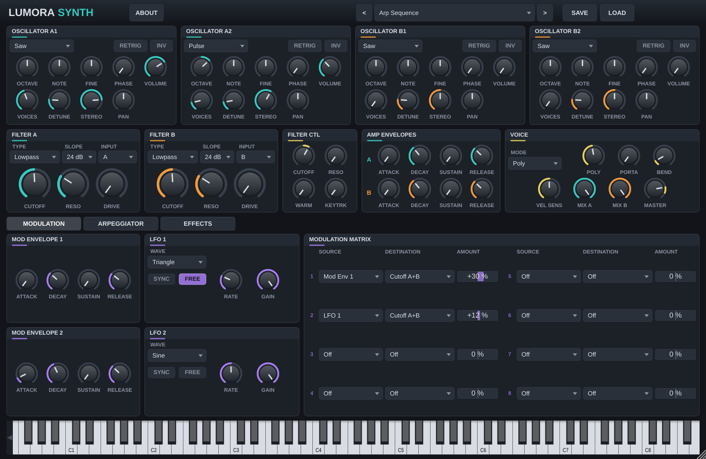

# Lumora Synth

Ein virtuell-analoger, polyphoner Software-Synthesizer als **VST3**-Plugin (dazu **AU** auf macOS und eine **Standalone**-App), gebaut mit [JUCE](https://juce.com).

Die Klangarchitektur lehnt sich an das bewährte Konzept klassischer „Two-Part“-Synths wie Sylenth1 an: zwei Parts (A und B) mit je zwei Oszillatoren, eigenem Filter und eigener Amp-Hüllkurve. Lumora Synth ist eine eigenständige Neuentwicklung. Code, Grafik und Presets stammen nicht von Lennar Digital, und das Plugin ist nicht mit Lennar Digital verbunden.



## Funktionen

**Klangerzeugung**
- 4 Oszillatoren (A1, A2, B1, B2): Sinus, Dreieck, Sägezahn, Rechteck, Pulse, Rauschen (bandbegrenzt per PolyBLEP)
- Unison mit bis zu 8 Stimmen pro Oszillator, Detune und Stereo-Breite
- Oktave, Halbton, Fine, Phase, Retrigger, Invert, Lautstärke, Pan pro Oszillator
- Bis zu 16 Stimmen Polyphonie, Modi Poly / Mono / Legato, Portamento, Pitchbend-Bereich, Velocity-Empfindlichkeit

**Filter**
- Filter A und B: Lowpass, Bandpass, Highpass, Notch, Bypass; 12 oder 24 dB/Okt.; Resonanz und Drive
- Filter-Eingang wählbar: nur eigener Part oder A + B
- Filter Control: globaler Cutoff-Offset, Resonanz, „Warm Drive“-Sättigung und Keytracking

**Modulation**
- 2 Amp-Hüllkurven (Part A / B), 2 Mod-Hüllkurven (ADSR)
- 2 LFOs: Sinus, Dreieck, Saw Up/Down, Rechteck, Sample & Hold, Smooth Random; frei oder zum Host-Tempo synchronisiert, Retrigger oder Free-Run
- Modulationsmatrix mit 8 Slots: Mod-Env 1/2, LFO 1/2, Velocity, Modrad, Aftertouch, Keytrack, Zufall auf Pitch (alle/A/B), Cutoff (A+B/A/B), Resonanz, Drive, Lautstärke (alle/A/B), Mix A/B, Pan, Detune, Stereo, LFO-Rate und -Gain

**Arpeggiator**
- Modi: Up, Down, Up/Down, Down/Up, Up/Down 2, Random, Ordered, Chord
- 1–4 Oktaven, Notenlänge von 4/1 bis 1/32 (punktiert/triolisch), Gate, Swing, Hold
- 16-Step-Pattern mit Ein/Aus, Transponierung (±24 Halbtöne) und Velocity pro Schritt
- Läuft synchron zur Host-Transportposition oder frei ab dem ersten Tastendruck

**Effekte** (Reihenfolge der Kette)
Distortion (Overdrive, Hard Clip, Foldback, Bitcrush, Decimate) → Phaser → Chorus/Flanger → EQ (Bass/Höhen-Shelf) → Delay (Ping-Pong, Tempo-Sync, Low-/High-Cut) → Reverb → Compressor

**Presets**
- 17 Werks-Presets (Leads, Plucks, Bässe, Pads, Arp, Keys, FX), auch als Host-Programme verfügbar
- Eigene Presets speichern/laden als `.lumora`-Dateien in `Dokumente/Lumora Synth/Presets`
- Skalierbare Oberfläche (Ecke unten rechts ziehen) und Bildschirmtastatur

## Installation (fertige Builds)

Jeder Push auf `main` baut das Plugin per GitHub Actions für Windows, macOS und Linux. Die Dateien findest du unter **Actions → letzter Lauf → Artifacts**, bei Tags `v*` zusätzlich unter **Releases**.

### macOS: Installer (empfohlen)

`LumoraSynth-macOS-Installer.pkg` herunterladen und öffnen. Der Installer legt VST3, Audio Unit und die Standalone-App für alle Benutzer ab; unter „Anpassen“ lassen sich einzelne Teile abwählen:

| Teil            | Zielordner |
|-----------------|------------|
| VST3            | `/Library/Audio/Plug-Ins/VST3/` |
| Audio Unit      | `/Library/Audio/Plug-Ins/Components/` |
| Standalone-App  | `/Applications/` |

Der Installer ist nicht von Apple signiert. Meldet macOS beim Öffnen, dass er nicht geprüft werden kann: Rechtsklick auf die Datei → **Öffnen**, oder unter **Systemeinstellungen → Datenschutz & Sicherheit** auf **Trotzdem öffnen** klicken. Danach die Plug-ins in der DAW neu scannen lassen.

### Manuell (ZIP)

| System  | Datei                    | Zielordner |
|---------|--------------------------|------------|
| Windows | `Lumora Synth.vst3`      | `C:\Program Files\Common Files\VST3\` |
| macOS   | `Lumora Synth.vst3`      | `~/Library/Audio/Plug-Ins/VST3/` |
| macOS   | `Lumora Synth.component` | `~/Library/Audio/Plug-Ins/Components/` |
| Linux   | `Lumora Synth.vst3`      | `~/.vst3/` |

Unter macOS sind die Builds nur ad-hoc signiert. Falls der Host das Plugin blockiert:

```bash
xattr -cr ~/Library/Audio/Plug-Ins/VST3/"Lumora Synth.vst3"
```

## Selbst bauen

Voraussetzungen: CMake ≥ 3.22 und ein C++17-Compiler (Visual Studio 2022 oder neuer, Xcode oder GCC/Clang). JUCE wird beim Konfigurieren automatisch heruntergeladen.

```bash
cmake -B build -DCMAKE_BUILD_TYPE=Release
cmake --build build --config Release
```

Die Ergebnisse liegen in `build/LumoraSynth_artefacts/Release/` (`VST3/`, `AU/`, `Standalone/`).

- Lokale JUCE-Kopie verwenden: `-DJUCE_DIR=/pfad/zu/JUCE`
- Linux-Abhängigkeiten (Debian/Ubuntu): `libasound2-dev libfreetype-dev libfontconfig1-dev libx11-dev libxcomposite-dev libxcursor-dev libxext-dev libxinerama-dev libxrandr-dev libgl1-mesa-dev`
- macOS Universal Binary: `-G Xcode -DCMAKE_OSX_ARCHITECTURES="arm64;x86_64"`

### Tests

`LumoraRenderTest` rendert jedes Preset offline und prüft auf NaN, Stille und Übersteuerung. Getestet werden außerdem Stimmen-Stealing, Mono/Legato, alle Arp-Modi, alle Modulationsziele mit Extremwerten, alle Filtertypen bei voller Resonanz, die gesamte Effektkette und das Speichern/Wiederherstellen des Zustands.

```bash
./build/LumoraRenderTest_artefacts/Release/LumoraRenderTest [ausgabeordner]
```

Mit Ausgabeordner schreibt der Test zusätzlich eine WAV-Datei pro Preset und Screenshots der Oberfläche. Die CI prüft das Plugin zusätzlich mit [pluginval](https://github.com/Tracktion/pluginval) auf Strenge 5.

## Projektstruktur

```
Source/
  Parameters.*        Parameterliste (IDs, Bereiche, Anzeigetexte)
  SynthParams.*       Parameter-Snapshots pro Audioblock
  Presets.*           Werks-Presets
  PluginProcessor.*   AudioProcessor: MIDI → Arp → Engine → Effekte → Master
  PluginEditor.*      Oberfläche
  dsp/
    Primitives.h      Oszillator (Unison, PolyBLEP), SVF-Filter, ADSR, LFO
    Voice.*           Stimme inkl. Modulationsmatrix
    SynthEngine.*     Stimmenverwaltung, Poly/Mono/Legato, Sustain
    Arpeggiator.*     Arpeggiator mit Step-Sequenzer
    Effects.*         Effektkette
  gui/                LookAndFeel und Bedienelemente
tests/RenderTest.cpp  Offline-Test
```

## Lizenz

Lumora Synth ist freie Software unter der **GNU Affero General Public License, Version 3 oder später** (`AGPL-3.0-or-later`). Den vollständigen Text findest du in [LICENSE](LICENSE).

Kurz gesagt:
- Du darfst das Plugin nutzen, verändern, weitergeben und auch verkaufen.
- Wer das Plugin (oder eine veränderte Version) weitergibt, muss den vollständigen Quellcode unter derselben Lizenz mitliefern oder zugänglich machen.
- Es gibt keine Gewährleistung.

Die Oberfläche zeigt Copyright und Lizenz über den Knopf **ABOUT** an.

Verwendete Komponenten:
- [JUCE](https://juce.com) – hier unter AGPLv3 genutzt (JUCE ist doppelt lizenziert: AGPLv3 oder kommerzielle JUCE-Lizenz)
- VST3 SDK (über JUCE) – Steinberg-Lizenz oder GPLv3; VST ist eine Marke der Steinberg Media Technologies GmbH
